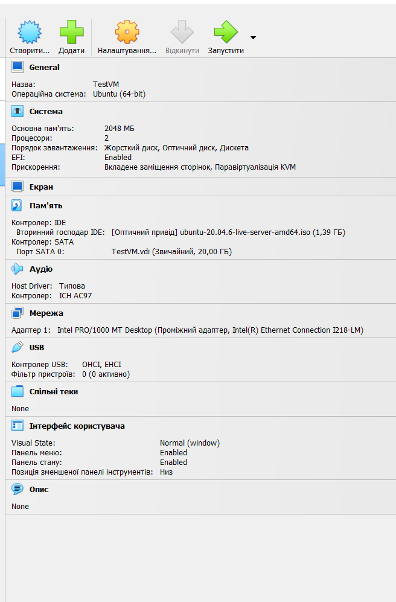
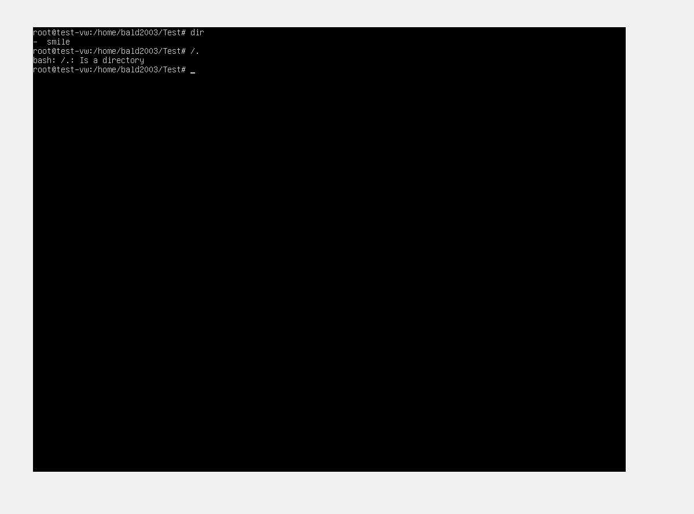
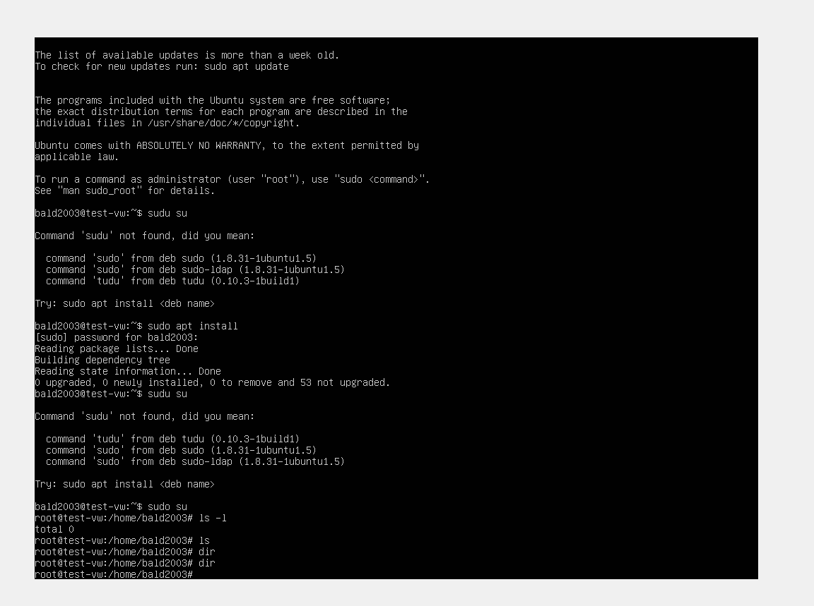
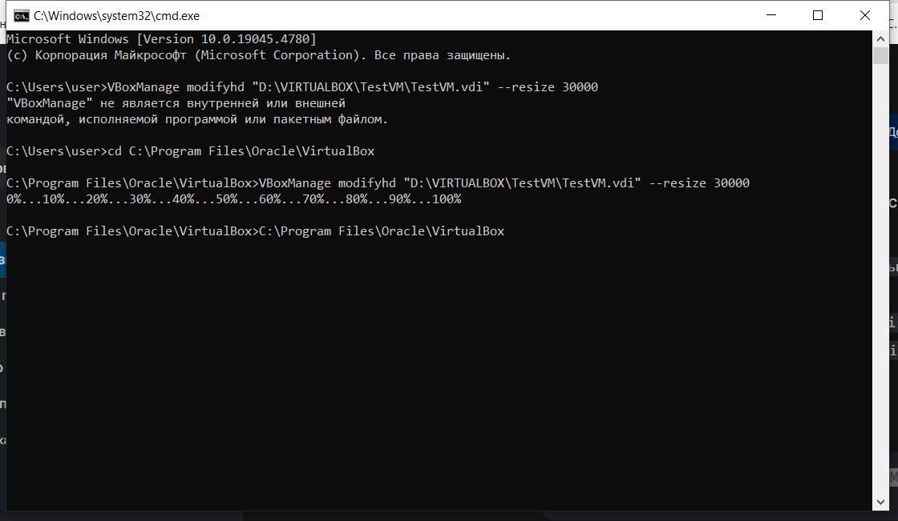
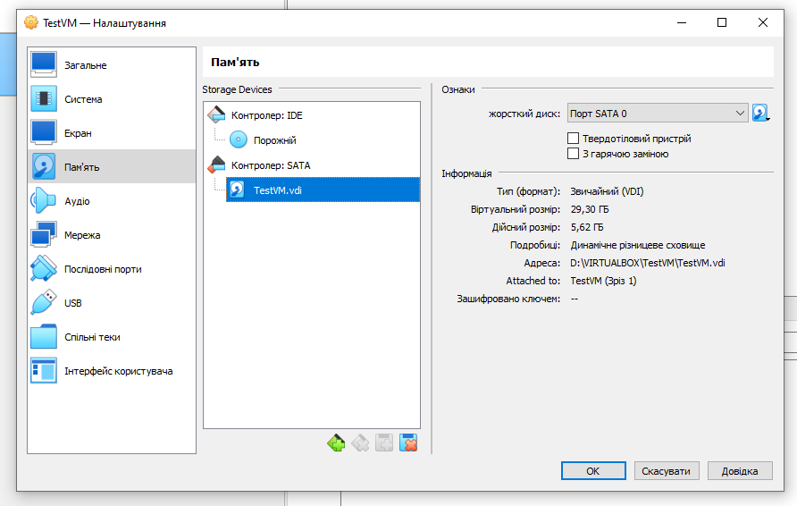
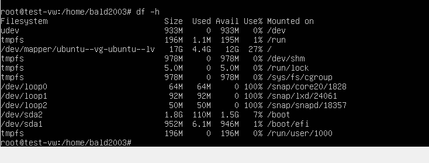
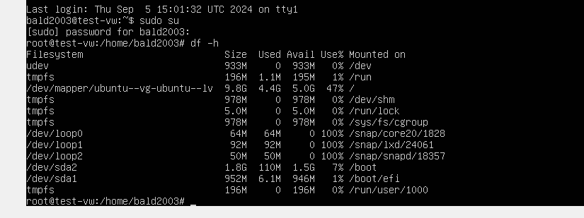

# Virtualization/VBox

## Установка віртуалбокс. Робота з віртуальною машиною. 

###1. Налаштування параметрів віртуальної машини

###2. Тестування зрізу снепшоту
#### Створення папки та файла у цій папці. Створення снепшоту.

#### Відновлення зрізу.
#### При відновленні зникла папка тафайл в ньому.

#### Збільшення розміру диску віртуальної машии VirtualBox
Знайдіть шлях до VBoxManage.exe: Зазвичай він знаходиться в папці встановлення VirtualBox (наприклад, C:\Program Files\Oracle\VirtualBox).
Відкрийте командний рядок:
Натисніть Win + R, введіть cmd і натисніть Enter.
Виконайте команду:
VBoxManage modifyhd "шлях_до_віртуального_диску.vdi" --resize новий_розмір_в_мегабайтах
Замініть шлях_до_віртуального_диску.vdi на фактичний шлях до вашого файлу віртуального диска, а новий_розмір_в_мегабайтах на бажаний розмір у мегабайтах.
Приклад:

VBoxManage modifyhd "D:\VIRTUALBOX\TestVM\TestVM.vdi" --resize 30000

#### Результат зміни розміру диска.

#### Команди як розширюють додаткоемісце призбільшенні віртуального диску 
Команди для убунту для зміни розміру диска.
sudo apt update
sudo apt install gparted
sudo parted -l
sudo lvextend -l +100%FREE /dev/mapper/ubuntu--vg-ubuntu--lv
sudo resize2fs /dev/mapper/ubuntu--vg-ubuntu--lv
df -h
#### До розширення

#### Після розширення
