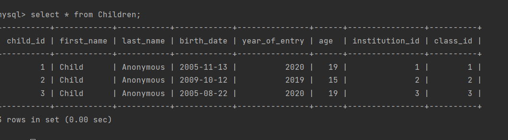

SELECT
Children.first_name AS ChildName,
Institutions.institution_name AS InstitutionName,
Classes.Institutions_direction AS ClassDirection
FROM
Children
INNER JOIN
Institutions ON Children.institution_id = Institutions.institution_id
INNER JOIN
Classes ON Children.class_id = Classes.class_id;

SELECT
Parents.first_name AS ParentName,
Children.first_name AS ChildName,
Parents.tuition_fee AS TuitionFee
FROM Parents
JOIN
Children ON Children.child_id=Parents.child_id;

SELECT Institutions.institution_name, Institutions.address, COUNT(Children.child_id) AS count_of_children
FROM
Institutions
join Children ON Children.institution_id=Institutions.institution_id
GROUP BY
Institutions.institution_id, Institutions.institution_name, Institutions.address;

Відновлення бази

UPDATE Children
SET first_name = 'Child', last_name = 'Anonymous';

