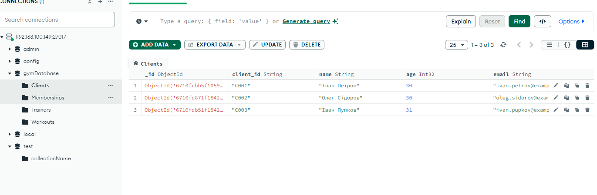

##Інсталяція системи на монгодб через скрипт вагранта

###Обовязково змінити у файлі конф змінити права доступу з інших мереж

`/etc/mongod.conf 

bind ... 127....0  на 0.0.0.0 `

##Статус сервера монго 

`sudo systemctl status mongod`

##Підключення до шела монгодб

`sudo mongosh
`

##Створення нової бази, але для її появи треба створити у ній хочаь одну пусту колекцію

`use gymDatabase`

##Створення нової колекції

`db.createCollection("clients");`

##Створення нового юзера до бази даних джим

`use admin
db.createUser(
{
user: "myUser",
pwd: passwordPrompt(),
roles: [ { role: "readWrite", db: "gymDatabase" } ]
}
)`
## Всі інші колекції зробив через компас та додав поля також через компас

##Знайдіть всіх клієнтів віком понад 30 років

`db.Clients.insertOne({ "client_id": "C001", "name": "Іван Петров", "age": 30, "email": "ivan.petrov@example.com" })`

##Знайдіть всіх клієнтів віком понад 30 років

`db.Clients.find({ age: { $eq: 30 } }, { name: 1, _id: 0 })`

##Перелічіть тренування із середньою складністю

`db.Workouts.find({ difficulty: "середній" }, { description: 1, _id: 0 })`

##Покажіть інформацію про членство клієнта з певним client_id`

`db.Memberships.find({ client_id: "C001" }, { type: 1, _id: 0 })`
