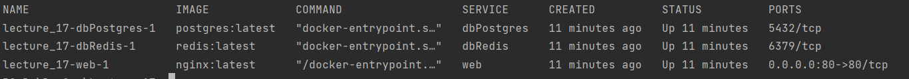
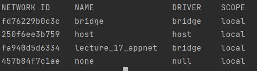
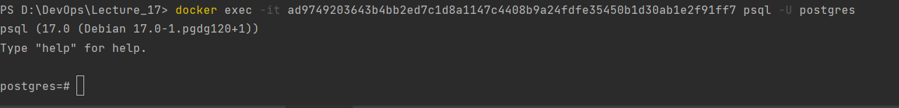
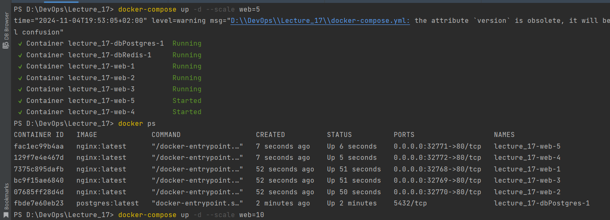

`docker-compose ps`

`docker network ls`

`docker volume ls`

`docker exec -it <ad9749203643b4bb2ed7c1d8a1147c4408b9a24fdfe35450b1d30ab1e2f91ff7> psql -U postgres`

`docker-compose up -d --scale web=3`

Для успішного створення однакових сервісів треба прописати
`ports:
- "0:80"`

