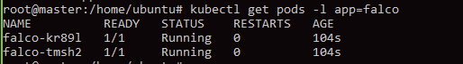
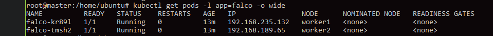
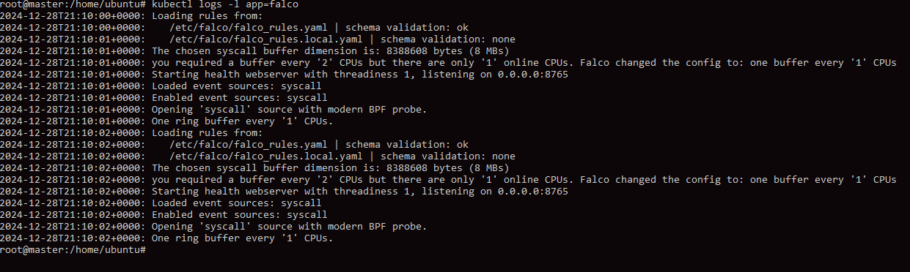

Зробив у авс два образи мастера та воркера. Тепер при створенні машин я обираю ці образи. 
Помітив що на воркере достатньо безкоштовних машин.

Почав з створення даемонсету  з фалко. Розгорув за допомогою ямл файла та команди аплай.

Перевірка розгортання та роботи Falco:

Перевірка логів Falco для виявлення подій:

