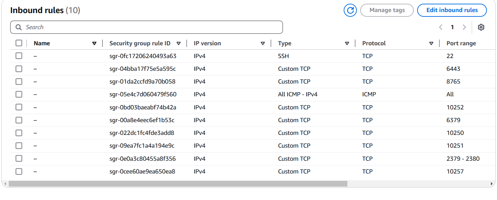
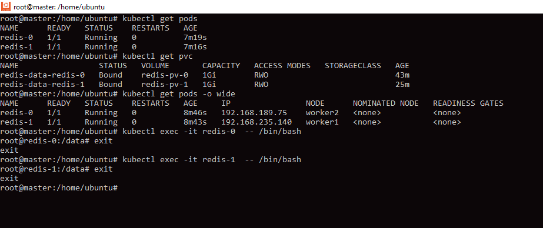

Зробив у авс два образи мастера та воркера. Тепер при створенні машин я обираю ці образи. 
Помітив що на воркере достатньо безкоштовних машин.

## Дуже важливо у авс у секьюреті груп відкрити порти для роботи фалко та редіса а також кубера та контейнерів

Почав з створення даемонсету  з фалко. Розгорув за допомогою ямл файла та команди аплай.

Перевірка розгортання та роботи Falco:

## Перевірка логів Falco для виявлення подій:

-------------------------------------------------------------------------

### Створення пресистем волума та стейтфулсета та сервіса обміну між подами за допомогою ямл файлів
Файли знаходятся у корні текі лекція 20

## Перевірка створенх подів та клеймів та доступу до подів редіса

## Перевірка збереження даних редіс пода після видалення пода

