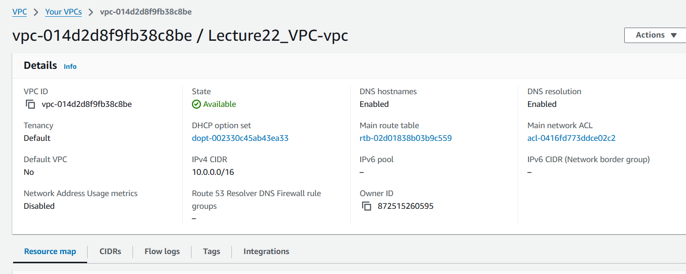
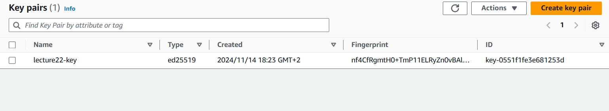
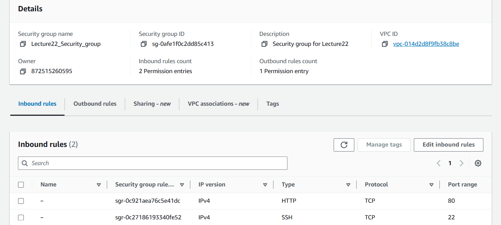
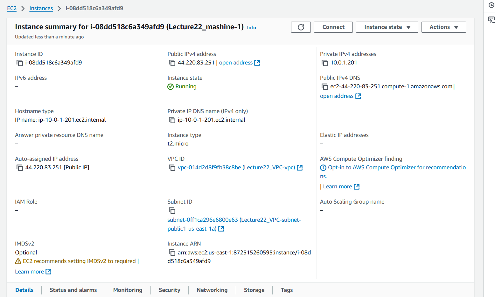
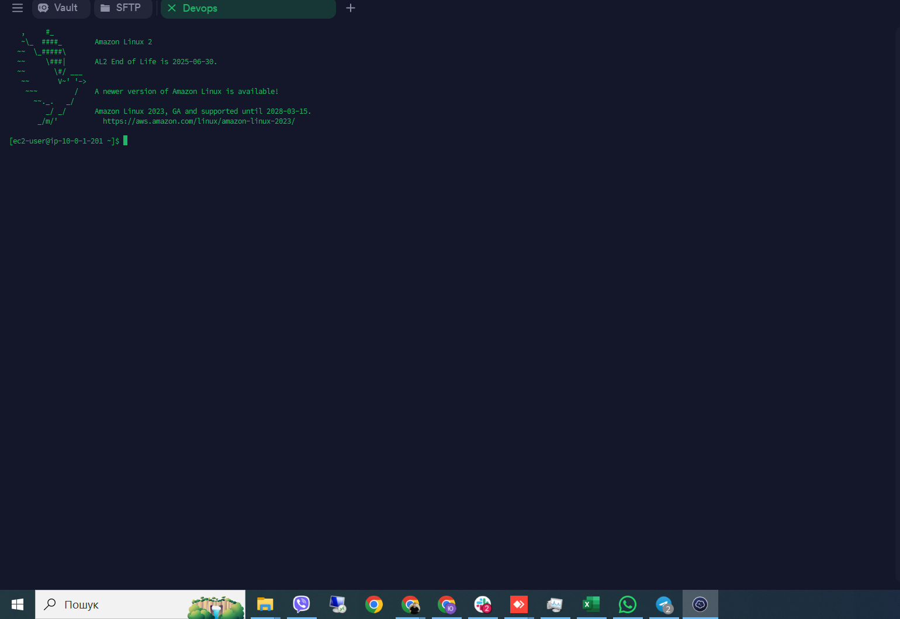

Створення VPC: одна публічна мережа, одна приватна, гетвей та нат

Створення ключа для підключення без паролю по ssh

Створення секьюр групи з доступом до ssh та HTTP із зовні

Створення віртуальної машини з зовнішнім білим айпі

Підключення до віртуальної машиги по SSH

