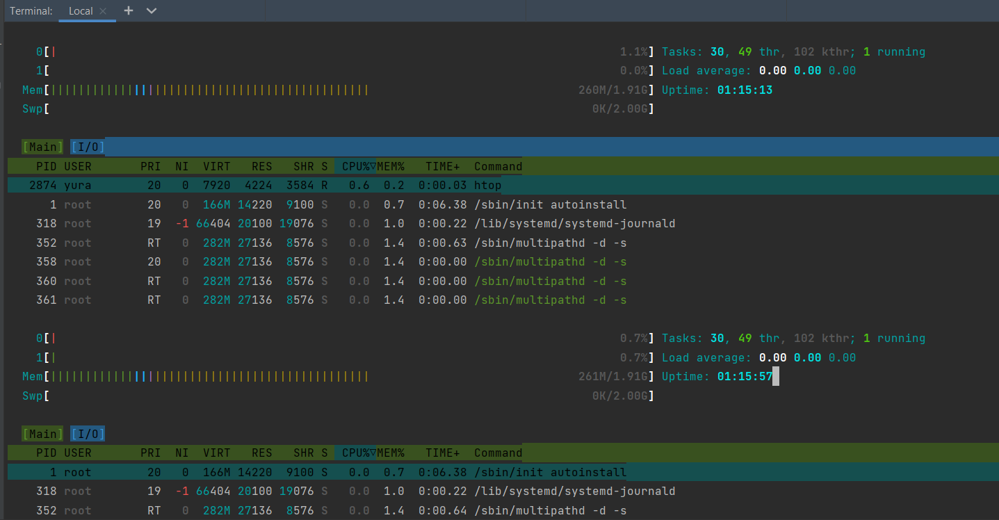

## Для встановлення додатків git htop  vim   використав баш-скріпт.

Lecture_5/scripts/install.sh

результат роботи скрипта файл Lecture_5/install.log :

```
Початок встановлення vim...
vim вже встановлено.
VIM - Vi IMproved 9.0 (2022 Jun 28, compiled Dec 04 2023 12:42:16)
Початок встановлення htop...
htop вже встановлено.
htop 3.2.2
Початок встановлення git...
git вже встановлено.
git version 2.40.1```
```
Виходячи з логу, то всі додатки були встановлені у образі убунти

Створення файла з історією команд та додавання до репозиторію


Дослідження додатк htop дає данні про ресурси задіяні у роботі та запущені процеси, 
також багато функціоналу по сортуванюю даних



