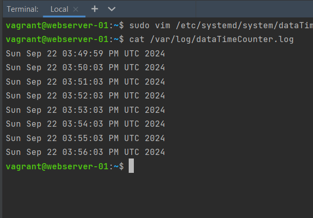
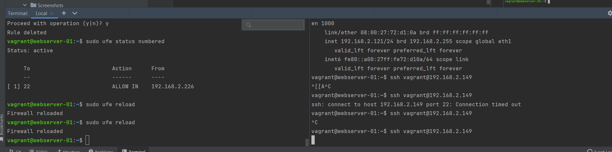
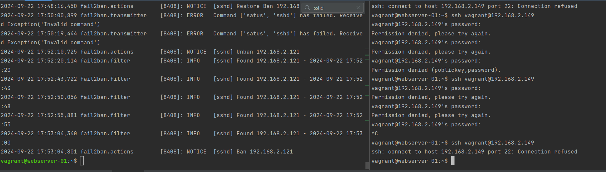

### Nginx - встановлення та налаштування. PPA репозиторій.

`vagrant@webserver-01:~$ nginx -v
nginx version: nginx/1.24.0 (Ubuntu)`

`sudo add-apt-repository ppa:nginx/stable
sudo apt update`

#### Попередження :
`The repository 'https://ppa.launchpadcontent.net/nginx/stable/ubuntu mantic Release' does not have a Relea
se file.`

### Тому я повернувся назад

`sudo add-apt-repository --remove ppa:nginx/stable
sudo apt update`

###Встановлення nginx
`vagrant@webserver-01:~$ apt-cache policy nginx
nginx:                       
Installed: 1.4.6-1ubuntu3.9
Candidate: 1.4.6-1ubuntu3.9

###Скріпт дати та часу

### Скріпт файл
`#!/bin/bash

LOG_FILE="/var/log/dateTimeCounter.log"

_while true; do
echo "$(date) $(time) " >> $LOG_FILE
sleep 60
done`
### Файл сервісу
`[Unit]
Description=Simple script to log date and time every minute
After=network.target

[Service]
Type=simple
ExecStart=/opt/dateTimeCounter.sh
ExecReload=/bin/kill -HUP $MAINPID
Restart=on-failure
RestartSec=5

[Install]
WantedBy=multi-user.target`

Вивід дати та часу кожну хвилину

### Закриття доступу до 22 порту усім окрім озаданого айпі

### Встановлення та налаштування fail2ban для ssh

