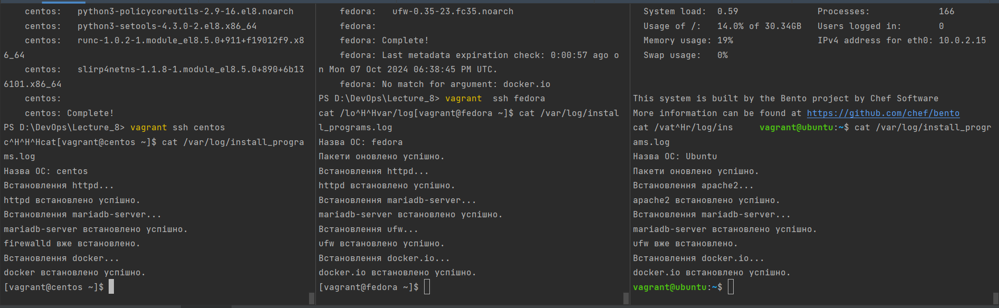

###Завдання
`Опційна:
● Напишіть Bash-скрипт для автоматичного встановлення пакетів (apache, mariaDB,
firewall, docker) та налаштування конфігів на різних дистрибутивах Linux із
використанням конструкції case, функцій та масивів.
Ваш скрипт повинен мати такі можливості:
● Вибір дистрибутива: скрипт сам визначає, на якому запускатися (наприклад, Ubuntu,
Fedora, CentOS тощо)
● Встановлення пакетів: створіть функцію для встановлення пакетів на обраному
дистрибутиві. Використовуйте відповідні команди пакетного менеджера для кожного
дистрибутива. Наприклад, на Ubuntu — apt-get, на Fedora — dnf, на CentOS — yum
● Додаткове встановлення пакетів, вказаних під час запуску скрипта (аргументи)
● Оновлення пакетів, якщо вони вже встановлені`

